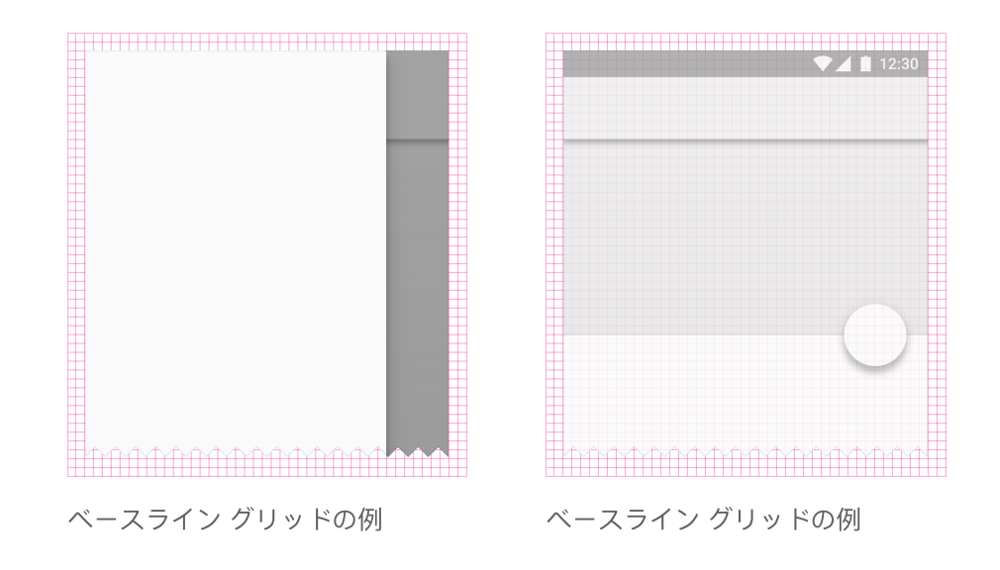

### マテリアル デザインのガイドライン（日本語版）を読んで振り返り

#### 2017/10/12
#### iwaisako.y
---
### マテリアル デザインのガイドライン（日本語版）
[link](https://material.io/jp/guidelines/)

---
### material_design.pdf

---
### マテリアルの動き
 
#### ユーザーによる操作は、通常は Z 軸に沿った動きとして表現します。
[動画](http://material-design.storage.googleapis.com/publish/material_v_4/material_ext_publish/0B6Okdz75tqQsQW1HYnpicTVySG8/whatismaterial-materialprop-movementmaterial-Material_Response_xhdpi_003.mp4)

---
### motion.pdf

---
### マテリアルの動き方
 
#### モバイル端末では、大きなアニメーションの継続時間は 300～400 ms、小さなアニメーションでは 150～200 ms になります。

---
### マテリアルの動き方
 
#### 要素がビューに遷移するとき、要素とその周りの要素は、互いの関係を示すような動きになっています。

[動画1](http://material-design.storage.googleapis.com/publish/material_v_8/material_ext_publish/0B14F_FSUCc01TFFreDdlSVp3dGc/Aware_01_Choreo-v2.mp4)　[動画2](http://material-design.storage.googleapis.com/publish/material_v_8/material_ext_publish/0B14F_FSUCc01RFdjQWE4ZXBseWM/Aware_02_MoveAway-v2.mp4)

---
### 優れた遷移の特徴
 
#### 遷移はわかりやすく、シンプルで、まとまりのあるものにします。一度に多くの動きを取り入れないでください。

[適切](http://material-design.storage.googleapis.com/publish/material_v_8/material_ext_publish/0B14F_FSUCc01NDkzU2FaYlFHMXM/GoodTransition_ClearDo-v3.mp4)　[不適切](http://material-design.storage.googleapis.com/publish/material_v_8/material_ext_publish/0B14F_FSUCc01VzRvLWJDTEE4WXM/GoodTransition_ClearDont-v3.mp4)

---
### モーションの意義
 
#### 動画のように、遷移中、ユーザーは次のビューへと導かれます。サーフェスは階層がわかるように変形しています。読み込みは背後で行われているため、遅れをあまり感じさせません。

[適切](http://material-design.storage.googleapis.com/publish/material_v_8/material_ext_publish/0B14F_FSUCc01Um1wdzhBR1ZuYVE/ImplicationsDo-v2.mp4)　[不適切](http://material-design.storage.googleapis.com/publish/material_v_8/material_ext_publish/0B14F_FSUCc01anJjQkt4QS1GRzQ/ImplicationsDont-v2.mp4)

---
### 継続時間とイージング
 

#### アニメーションの継続時間が400msを超えると遅いと思われる可能性がある。距離や端末の大きさにより継続時間は変わる。

[参考URL](https://qiita.com/takahirom/items/61976bdebe2c18dfce82)

---
### コレオグラフィ（振付？）レイアウトを意識する。
 
#### 遷移中にまだ読み込まれていない要素のためのスペースを確保しておき、要素が完全に読み込まれたら、その場所にスムーズに表示します。

[動画](http://material-design.storage.googleapis.com/publish/material_v_8/material_ext_publish/0B14F_FSUCc01TGhVWlZaam5CNVU/Continuity_06_LayoutAwareDo_v2.mp4)

---
### コレオグラフィ（振付？）サーフェスに動きを付ける。
 
#### 複数の新しいサーフェスを同時に作成する場合は、各サーフェスの出現をわずかにずらします。明確で滑らかな焦点のパスを一方向に作ります。各アイテムは 20 ms 以上空けずに開始してください。

[動画](http://material-design.storage.googleapis.com/publish/material_v_8/material_ext_publish/0B14F_FSUCc01MlpxcWE2X1VVNU0/CreationChoreo_03_StaggerDo_v3.mp4)

---
### コレオグラフィ（振付？）自律的なサーフェスの作成
 
#### ユーザー入力や起点なしでサーフェスを作成する場合は、フェーディング、位置、スケーリングの変化などを適切に組み合わせてください。

[動画](http://material-design.storage.googleapis.com/publish/material_v_8/material_ext_publish/0B14F_FSUCc01Znc0RmE0Ni0taFU/CreationChoreo_06_NewDialogueDo_v2.mp4)

---
### クリエイティブなカスタマイズ　システム アイコン
 
#### 再生ボタンが一時停止ボタンに変わることで、2 つのアクションがリンクされていることと、一方を押すともう一方が表示されることがわかります。
[動画](http://material-design.storage.googleapis.com/publish/material_v_8/material_ext_publish/0B14F_FSUCc01dWJzTWlsVGdPT0E/DD_Icon_Anim_Play_v2.mp4)

---
### style.pdf
#### 文字とか色関連。ここは割愛。

---
### layout.pdf

---
### ベースライン グリッド
 
###### モバイル、タブレット、パソコンでは、すべての要素を 8 dp四方のベースライン グリッドに揃えて配置します。ツールバーに表示するアイコン画像は、4 dp 四方のベースライン グリッドに揃えて配置します。文字は 4 dp のベースライン グリッドに揃えて入力します。
{:height="50%" width="50%"}

---
### タップ ターゲットのサイズ
 
#### タップ ターゲットのサイズを 48 x 48 dp以上にする必要があります。タップ ターゲット間には 8 dp 以上のスペースを挿入します

---
### components.pdf

---
### フラットボタン
 
#### 押した状態: 40% #999999。

[動画](http://material-design.storage.googleapis.com/publish/material_v_4/material_ext_publish/0B3T7oTWa3HiFbjE5djFGMzdKcmc/components-buttons-flatbuttons.mp4)

---
### ダイアログ　シンプルメニュー
 
#### リンクをクリックしたらポップアップメニューが表示される。

# 画像必要

---
### デバイダー（リストなどの区切り線）
 
#### ライトテーマでは透明度 12% のブラック、ダークテーマでは透明度 12% のホワイトで、幅は 1dp

---
### リスト: コントロール
 
#### 水平にスワイプして隠しメニュを表示する。

---
### 選択ツール
 
#### モバイルでは、選択ツールは確認ダイアログに表示するのが最も適しています。フォームなどのインライン表示の場合は、セグメント プルダウン ボタンのようなコンパクトなコントロールを使用することをおすすめします。

---
### 進行状況とアクティビティ
 
#### マンガParkのようなダイアログのインジケータは見当たらない。

[動画1](http://material-design.storage.googleapis.com/publish/material_v_4/material_ext_publish/0B6Okdz75tqQsZ0V1QXpxOVdsTXM/components-progressactivity-behavior_Loading_SwipeDown_xhdpi_005.mp4)　[動画2](http://material-design.storage.googleapis.com/publish/material_v_4/material_ext_publish/0B6Okdz75tqQsbjk2UFZsOGNENkE/components-progressactivity-behavior-Loading_Files_Circular_xhdpi_003.mp4)

---
### スナックバーとトースト
 
#### お気に入り消した後にスナックバーで通知とUNDOメニューの提供

---
### タブ
 
#### タブ間のナビゲーションにはスワイプ操作が使用されるため、スワイプ操作に対応するコンテンツにはタブを使用しないでください。たとえば、スワイプでコンテンツを水平に移動できる地図や項目を削除できるリストでは、タブの使用を避けてください。

#### 追記：google Playではスワイプ操作するコンテンツでもタブを使っています。

---
### テキスト欄
 
#### フォームのデザイン｡入力エラーの表現など

---
### patterns.pdf

---
### エラー
 
#### アプリのエラー。ユーザに原因を伝える。回復させる操作があるならそれを伝える。
#### 矛盾状態のエラー。機内モードのときに電話掛けるなど、ユーザの操作が原因であるかのように表現を使わない。

---
### 画面遷移　親から子への遷移
 
#### 高度を変えることによって、親要素から子要素へのフォーカスの変化を示します
[動画](http://material-design.storage.googleapis.com/publish/material_v_4/material_ext_publish/0B6Okdz75tqQsYkFhbTNWaHpydm8/patterns_navigational-transitions_parent-to-child_list-02_xhdpi_019.mp4)　[動画](http://material-design.storage.googleapis.com/publish/material_v_4/material_ext_publish/0B6Okdz75tqQsV2JxZnUyNVB1eWc/patterns_navigational-transitions_parent-to-child_calendar_tablet_xhdpi_004.mp4)　

---
### 通知
 
#### 以下の場合は通知を使用すべきではありません。情報が既に画面に表示されている場合（たとえば進行中のチャットの会話）。ユーザーの関与を必要としない技術的な操作（たとえば同期）。ユーザーの関与なしで解決できる一時的なエラー状態

#### アプリの設定で、通知を無効にしたり変更したりできるようにしてください。

---
### 通知 ポップアップ通知
 
#### 新しいSMSメッセージが届いた場合などに使う。

---
### 選択　チェックボックス
 
#### チェックボックス（または独自に作成したそれに類するもの）は、タスクリストやチェックリストで各項目が完了したことを示す場合にのみ使用してください。モバイルでは、選択操作に使用しないようにしてください。

---
### 選択　項目の選択
 
#### リストやグリッドのコンテナは、複数選択に対応させることを強く推奨します。ただし、選択できる操作が 1 つしかない場合（たとえば電話番号のリストにおいて発信が唯一の選択肢である場合）は例外です。

---
### スワイプでの更新
 
#### コンテンツの更新。おすすめの方法は、同期を使用したコンテンツの自動更新です。同期ではユーザーの操作が必要ないため、アプリのコンテンツが自動的に最新の状態に保たれます。

---
### growth_communication.pdf

---
### ユーザー補助（障害を持ったユーザの考慮）　読みやすさ
 
#### 大きいフォントサイズでも快適に使えるようにする。

---
### 双方向性
 
#### 文章が左から始まる言語対応。ヘブライ語とか。

---
### resources.pdf

---
#### 文章が左から始まる言語対応。ヘブライ語とか。

